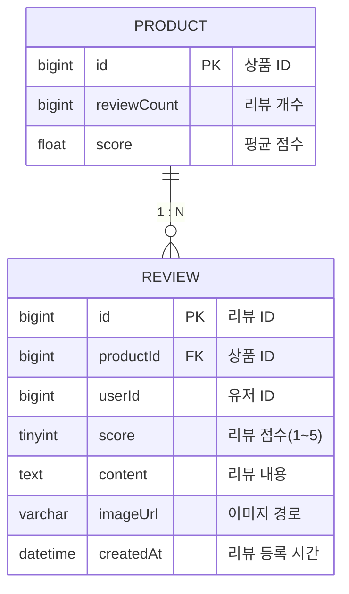

**[ ERD ]**

```mermaid
erDiagram
    PRODUCT {
        bigint id PK "상품 ID"
        bigint reviewCount "리뷰 개수"
        float score "평균 점수"
    }
    
    REVIEW {
        bigint id PK "리뷰 ID"
        bigint productId FK "상품 ID"
        bigint userId "유저 ID"
        tinyint score "리뷰 점수(1~5)"
        text content "리뷰 내용"
        varchar imageUrl "이미지 경로"
        datetime createdAt "리뷰 등록 시간"
    }

    PRODUCT ||--o{ REVIEW : "1 : N"
    
```